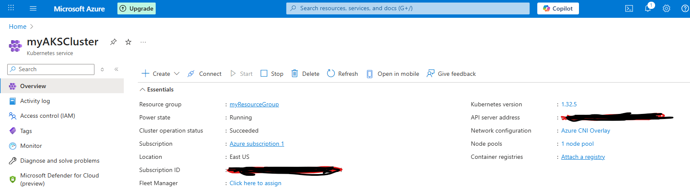
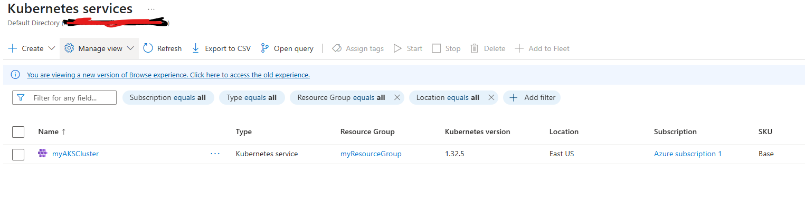
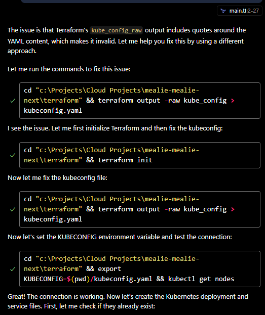
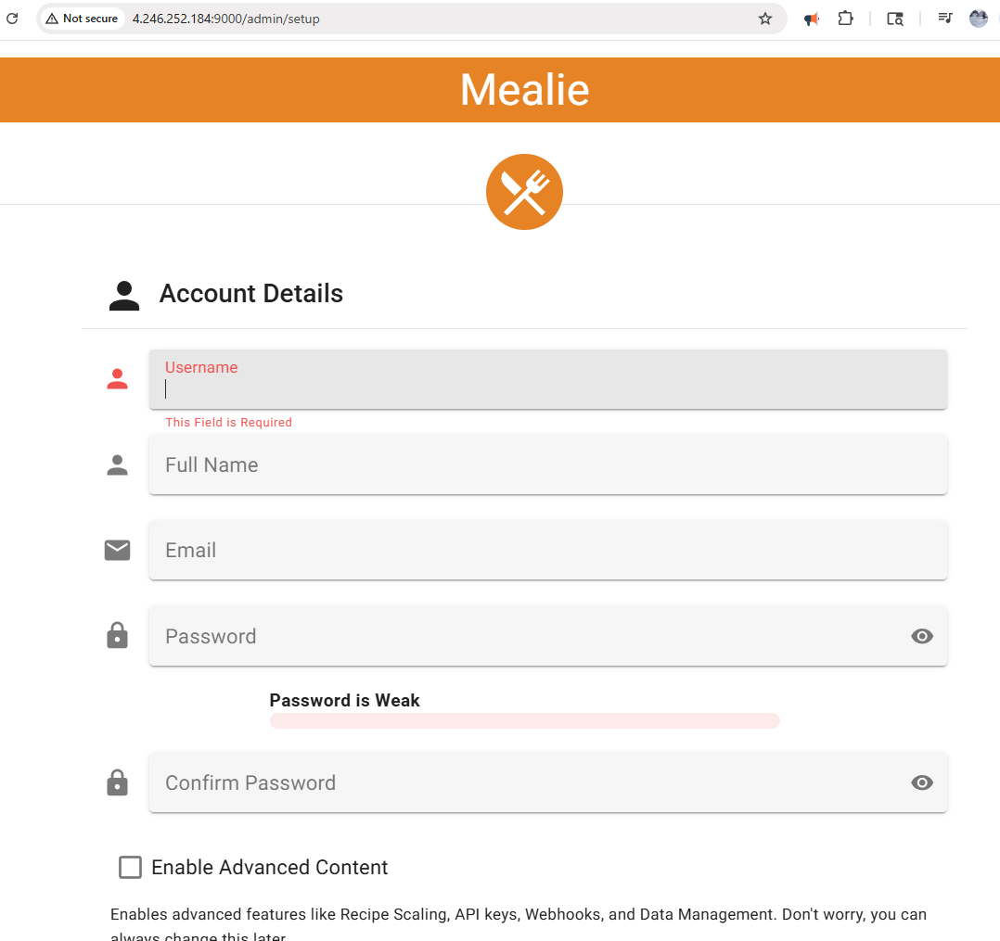
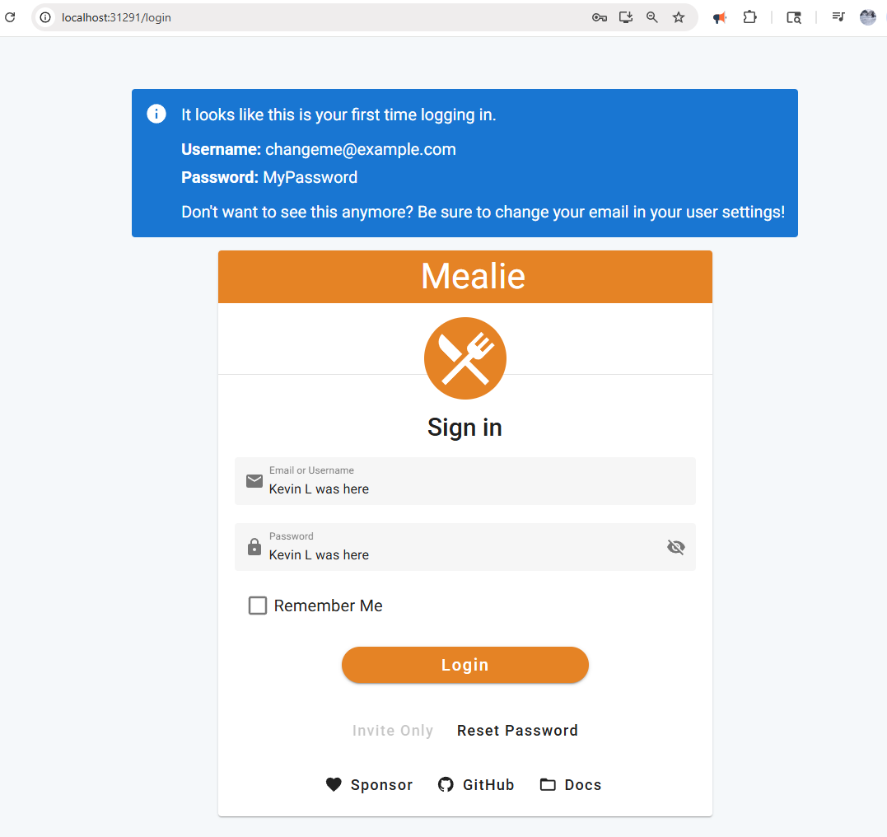
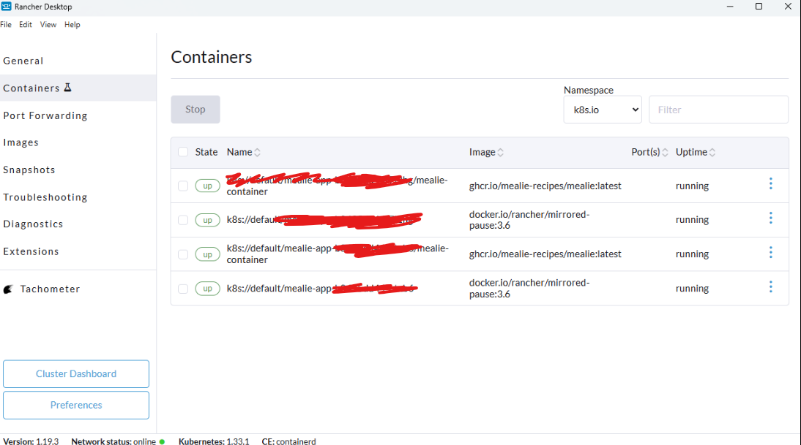

# Disclaimer
This project code development is not my original work. All rights belong to the respective creator(s). I, Kevin Llanos, used it only for learning purposes and handled infrastructure and deployment.

# Azure Kubernetes Mealie App Deployment

## **Overview**
This project demonstrates how to deploy the Mealie application, a recipe management tool, on Kubernetes using Rancher Desktop for local development and Azure AKS for cloud deployment. The goal is to provide a step-by-step guide for junior developers to understand Kubernetes concepts and cloud infrastructure automation using Terraform.

---

## **Tools Used**
1. **Rancher Desktop**: For local Kubernetes cluster management.
2. **WSL Ubuntu**: To enable Linux-based development on Windows.
3. **Kubectl**: Command-line tool for Kubernetes management.
4. **Azure CLI**: For Azure authentication and resource management.
5. **Terraform**: Infrastructure-as-code tool for automating Azure resource creation.

---

## **Problem Statement**
The goal is to deploy the Mealie application on Kubernetes for recipe management. The deployment starts locally using Rancher Desktop and then transitions to the cloud using Azure AKS. This project solves the problem of understanding Kubernetes deployment workflows and cloud infrastructure automation.

---

## **Steps to Deploy Mealie Application**

### **1. Set Up Rancher Desktop**
1. Open Rancher Desktop.
2. Enable WSL settings for Ubuntu in Rancher Desktop settings.
3. Verify that Rancher Desktop is working with WSL by running:
   ```bash
   kubectl version
   ```

---

### **2. Create Kubernetes Configuration Files**
1. Create a folder named `kubernetes` in your project directory.
2. Add the following two YAML files:

#### **deployment.yaml**
```yaml
apiVersion: apps/v1
kind: Deployment
metadata:
  name: mealie-app
  labels:
    app: mealie
spec:
  replicas: 2
  selector:
    matchLabels:
      app: mealie
  template:
    metadata:
      labels:
        app: mealie
    spec:
      containers:
      - name: mealie-container
        image: ghcr.io/mealie-recipes/mealie:latest
        imagePullPolicy: Always
        ports:
        - containerPort: 9000
        env:
        - name: HOST
          value: "0.0.0.0"
        - name: APP_PORT
          value: "9000"
        resources:
          limits:
            memory: "512Mi"
            cpu: "500m"
          requests:
            memory: "256Mi"
            cpu: "250m"
        volumeMounts:
        - name: mealie-data
          mountPath: /app/data
      volumes:
      - name: mealie-data
        emptyDir: {}
```

#### **service.yaml**
```yaml
apiVersion: v1
kind: Service
metadata:
  name: mealie-service
  labels:
    app: mealie
spec:
  selector:
    app: mealie
  ports:
  - protocol: TCP
    port: 9000
    targetPort: 9000
  type: NodePort
```

---

### **3. Deploy on Rancher Desktop**
1. Run the following command to deploy the application:
   ```bash
   kubectl apply -f kubernetes/
   ```
2. Verify the deployment and service:
   ```bash
   kubectl get pods
   kubectl get services
   ```

---

### **4. Set Up Azure CLI**
1. Install Azure CLI from [Azure CLI Installation Guide](https://docs.microsoft.com/en-us/cli/azure/install-azure-cli-windows).
2. Log in to Azure:
   ```bash
   az login
   ```
   Follow the prompts to authenticate.

---

### **5. Configure Terraform**
1. Create a folder named `terraform` in your project directory.
2. Add the following `main.tf` file:
   ```tf
   provider "azurerm" {
     features {}
     subscription_id = "<your-subscription-id>" # Replace with your Azure subscription ID
     # Uncomment and fill in these values if you have a service principal
     # client_id       = "<your-client-id>"
     # client_secret   = "<your-client-secret>"
     # tenant_id       = "<your-tenant-id>"
   }

   resource "azurerm_resource_group" "rg" {
     name     = "myResourceGroup"
     location = "eastus"
   }

   resource "azurerm_kubernetes_cluster" "aks" {
     name                = "myAKSCluster"
     location            = azurerm_resource_group.rg.location
     resource_group_name = azurerm_resource_group.rg.name
     dns_prefix          = "mealie"

     default_node_pool {
       name            = "default"
       node_count      = 1
       vm_size         = "Standard_B2s"
     }

     identity {
       type = "SystemAssigned"
     }
   }

   output "kube_config" {
     value     = azurerm_kubernetes_cluster.aks.kube_config_raw
     sensitive = true
   }
   ```

---

### **6. Deploy on Azure AKS**
1. Initialize Terraform:
   ```bash
   terraform init
   ```
2. Apply the configuration:
   ```bash
   terraform apply
   ```
   Confirm with `yes` when prompted.
3. Save the Kubernetes configuration:
   ```bash
   terraform output -raw kube_config > kubeconfig.yaml
   ```
4. Set the `KUBECONFIG` environment variable:
   ```bash
   export KUBECONFIG=$(pwd)/kubeconfig.yaml
   ```
5. Verify the connection:
   ```bash
   kubectl get nodes
   ```

---

### **7. Deploy Mealie Application on AKS**
1. Apply the Kubernetes configuration files:
   ```bash
   kubectl apply -f kubernetes/
   ```
2. Verify the deployment and service:
   ```bash
   kubectl get pods
   kubectl get services
   ```

---

### **8. Access the Application**
1. Check the service details:
   ```bash
   kubectl get service mealie-service
   ```
2. Note the external IP and access the application in your browser:
   ```
   http://<EXTERNAL-IP>:9000
   ```

---

### **9. Clean Up Resources**
1. Destroy the Azure resources:
   ```bash
   terraform destroy
   ```
   Confirm with `yes` when prompted.

---
## Challenges Faced During Deployment

- **Local Deployment**: Configured Kubernetes resources (`deployment.yaml` and `service.yaml`) for Rancher Desktop and verified using `kubectl`.
- **Azure AKS Setup**: Automated AKS cluster creation using Terraform and verified compatibility with free-tier VM size (`Standard_B2s`).
- **Sensitive Files**: Excluded files like `main.tf`, `.tfstate`, and `kubeconfig.yaml` using `.gitignore`.
- **Large Files**: Removed Terraform provider files exceeding GitHub's 100MB limit by adding `.terraform/` to `.gitignore` and cleaning Git history.
- **Secret Scanning**: Addressed AWS access keys detected in test files by excluding `tests/data/html/` and cleaning Git history.
- **Repository Cleanup**: Used `git filter-repo` to remove sensitive files and large files, then pushed the cleaned repository.

## Lessons Learned
- Review `.gitignore` entries carefully to exclude sensitive files.
- Use `git filter-repo` for cleaning up repository history.
- Monitor GitHub's secret scanning and file size limits to avoid push failures.

## **Conclusion**
This project demonstrates the complete workflow for deploying a Kubernetes application locally and on the cloud. It provides hands-on experience with Rancher Desktop, Azure AKS, and Terraform, making it ideal for junior developers to learn Kubernetes and cloud infrastructure automation.

## **Screenshots**









<!-- CONTRIBUTING -->
## Contributing

Contributions are what make the open source community such an amazing place to learn, inspire, and create. Any contributions you make are **greatly appreciated**. If you're going to be working on the code-base, you'll want to use the nightly documentation to ensure you get the latest information.

- See the [Contributors Guide](https://nightly.mealie.io/contributors/developers-guide/code-contributions/) for help getting started.
- We use [VSCode Dev Containers](https://code.visualstudio.com/docs/remote/containers) to make it easy for contributors to get started!

If you are not a coder, you can still contribute financially. Financial contributions help me prioritize working on this project over others and helps me know that there is a real demand for project development.

<a href="https://www.buymeacoffee.com/haykot" target="_blank"></a>

### Translations

Translations can be a great way for **non-coders** to contribute to the project. We use [Crowdin](https://crowdin.com/project/mealie) to allow several contributors to work on translating Mealie. You can simply help by voting for your preferred translations, or even by completely translating Mealie into a new language.

For more information, check out the translation page on the [contributor's guide](https://nightly.mealie.io/contributors/translating/).

<!-- LICENSE -->
## License
Distributed under the AGPL License. See `LICENSE` for more information.


## Sponsors

Huge thanks to all the sponsors of this project on [Github Sponsors](https://github.com/sponsors/hay-kot) and Buy Me a Coffee. Without you, this project would surely not be possible.

Thanks to Depot for providing build instances for our Docker image builds.

[](https://depot.dev?utm_source=Mealie)


<!-- MARKDOWN LINKS & IMAGES -->
<!-- https://www.markdownguide.org/basic-syntax/#reference-style-links -->
[contributors-shield]: https://img.shields.io/github/contributors/mealie-recipes/mealie.svg?style=flat-square
[docker-pull]: https://img.shields.io/docker/pulls/hkotel/mealie?style=flat-square
[docker-url]: https://hub.docker.com/r/hkotel/mealie
[ghcr-pulls]: https://img.shields.io/badge/dynamic/json?url=https%3A%2F%2Fipitio.github.io%2Fbackage%2Fmealie-recipes%2Fmealie%2Fmealie.json&query=%24.downloads&style=flat-square&label=ghcr%20pulls
[ghcr-url]: https://github.com/mealie-recipes/mealie/pkgs/container/mealie
[contributors-url]: https://github.com/mealie-recipes/mealie/graphs/contributors
[stars-shield]: https://img.shields.io/github/stars/mealie-recipes/mealie.svg?style=flat-square
[stars-url]: https://github.com/mealie-recipes/mealie/stargazers
[issues-shield]: https://img.shields.io/github/issues/mealie-recipes/mealie.svg?style=flat-square
[issues-url]: https://github.com/mealie-recipes/mealie/issues
[latest-release-shield]: https://img.shields.io/github/v/release/mealie-recipes/mealie?style=flat-square&label=latest%20release
[latest-release-url]: https://github.com/mealie-recipes/mealie/releases
[license-shield]: https://img.shields.io/github/license/mealie-recipes/mealie.svg?style=flat-square
[license-url]: https://github.com/mealie-recipes/mealie/blob/mealie-next/LICENSE
[linkedin-shield]: https://img.shields.io/badge/-LinkedIn-black.svg?style=flat-square&logo=linkedin&colorB=555
[linkedin-url]: https://linkedin.com/in/hay-kot
[product-screenshot]: docs/docs/assets/img/home_screenshot.png
